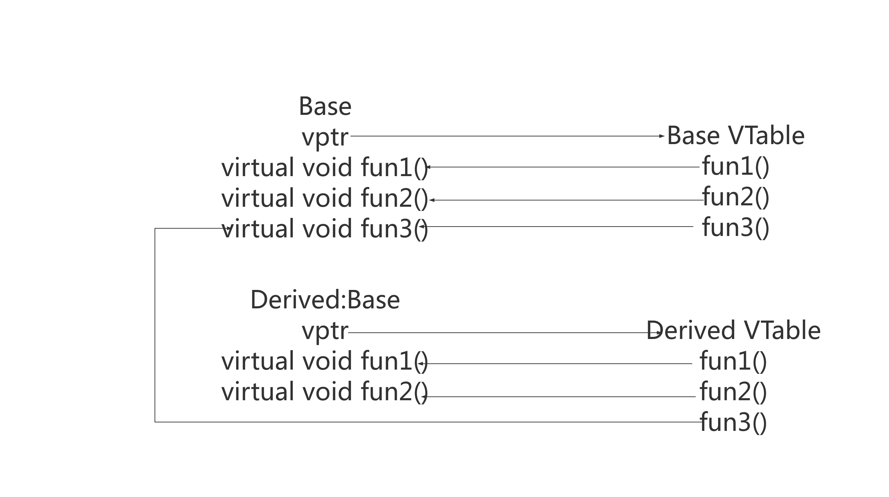

# assert

```cpp
#include <stdio.h> 
// assert在这头文件中, 
// 可以在引入这个文件前,通过 #define NDEBUG 禁用断言宏
// #define NDEBUG
#include <assert.h> 

int main() 
{ 
    int x = 7; 
    x = 9; 
    // 必须x等于7,否则报错,这是一种正向判断,也就是必须这样.否则报错.
    assert(x==7); 
    return 0; 
} 
```
# const
const常量具有类型，编译器可以进行安全检查；#define宏定义没有数据类型，只是简单的字符串替换，不能进行安全检查
const常量支持所有类型
其他情况下它只是一个 const 限定的变量，不要将与常量混

```bash
const char * a; //指向const对象的指针或者说指向常量的指针。
char const * a; //同上
char * const a; //指向类型对象的const指针。或者说常指针、const指针。
const char * const a; //指向const对象的const指针。
```
这里其实很好理解,将`const char` 看成一个类型,`*a`是一个指向`const char`类型的指针. 因为这个对象类型是常量类型,所以不能边.
而 `* const a` 就是用`const`修饰`*a`的固定写法. 见到这种,就认为这个指针本身不可变就行了.

其实只需要记住 `* const` 这种情况,也就是当const在`*`右边:说明这个指针不能被改变.别的情况都不用记的.

指针换成引用也是一样的道理.

常用例子:
```cpp
int func(const class & a){};
int getField() const {} // 相当于 getField(const A * const this)
```

# static

`static`修饰的东西是全局的. 只能存在一个,且有特殊内存空间.


- `static` 变量的生命周期与程序的生命周期相同，即在程序运行期间一直存在，而不是在函数调用结束后就被销毁。
- `static` 函数的作用域仅限于定义该函数的文件，即只能在该文件中被调用。
- `static` 类成员属于整个类，而不是某个对象，因此所有对象共享同一个静态成员。
- `static` 成员函数不属于任何类对象或类实例

常用例子:

```cpp
// 单例
class demo {
public:
    static demo & instance();
};

demo & demo::instance() {
    static demo ins;
    return ins;
}
// 需要多个模块共享访问时,也可以使用 static
// 一些小功能,适当使用static,会很方便
```
# this
成员函数的默认参数,相当于rust中的self.
# inline
内联,将一些简短的方法,代码贴到别的函数中,这样可以减少一次函数调用.

内联是可以修饰虚函数的，但是当虚函数表现多态性的时候不能内联.因为内联要在编译期,确定代码片段.
常用例子
```cpp
inline void A::f1(int x){

}
```
# sizeof
计算类型大小
- 类的大小根据成员变量决定,具体是对齐以后的大小.
- 派生类的大小是基类+派生累的所有成员的大小.
- 虚函数无论多少个,都是8个字节大小.
```cpp
class A{};
sizeof(A);
```
# 函数指针
可以声明函数指针变量和函数指针类型
```cpp
// FuncPtr 是一种类型,这种方式很通用.方便.
typedef void (*FuncPtr)(void);

void func() { 
    cout << "This is a function." << endl;
}

int main() {
    FuncPtr fp = &func; 
    fp(); 
    return 0;
}
// 如果只是简单使用,直接创建一个函数指针变量用
void func() { 
    cout << "This is a function." << endl;
}

int main() {
    void (*fp)(void) = &func;
    fp(); 
    return 0;
}
```
# 虚函数
- 使用`virtual`修饰的函数是虚函数.如果 ` virtual void func() = 0`,则这个函数是纯虚函数.
- 只有使用`virtual`修饰的函数,派生类才能使用`override`重写函数,当然也可以选择不覆盖. 如果要覆盖的话,`virtual`和`override`要成对出现.
```cpp
class Base {
public:
    virtual void func() = 0; // 纯虚函数
};

class Derived : public Base {
public:
    void func() override { // 使用 override 修饰符
        // 实现函数体
    }
};
```

# 虚表
[https://github.com/pzxy/CPlusPlusThings/tree/master/basic_content/vptr_vtable](https://github.com/pzxy/CPlusPlusThings/tree/master/basic_content/vptr_vtable)

虚表是一种用于动态绑定的方式.
rust中通过这种办法,来抹除trait对象的类型.称为动态分发

# virtual
- 构造函数不能用 `virtual` 修饰,因为虚表中的`vptr`需要再构造期间创建,这段代码是编译器加上去的,如果构造函数是虚函数,则不能创建`vptr`了.
- 析构函数可以用 `virtual` 修饰.并且如果这个类本省就是为了让别的类继承,那么析构函数就应该使用 `virtual` 修饰.
- 还有一些偏门的例子,就认为错的就行了,只关注正确的就行了.

正常例子:
```cpp
// 作为基类
class Base {
public:
    Base();
    virtual ~Base();
    virtual void func() = 0; // 纯虚函数
};
```

# dynamic_cast
多态类型间进行转换,相比`C`风格的强制类型转换和`C++ `, `reinterpret_cast`，`dynamic_cast`提供了类型安全检查.


# volatile  
- `volatile` 修饰的变量,编译器不会去优化.
- `volatile` 修饰的变量,每次都会去内存中读取,而不是读寄存器中的值.

```cpp
// 1. 编译器进行优化
int  *output = (unsigned  int *)0xff800000; //定义一个IO端口；  
int  init(void)  {  
    int i;  
    for(i=0;i< 10;i++)
    {  
    *output = i;  
    }  
}
// 优化成了这个
int  init(void)  
{  
    *output = 9;  
}
// 2. 必须从内存中读取
int square(volatile int *ptr) { 
    int a,b; 
    // 第一次从内存中读取 ptr
    a = *ptr; 
    // 第二次从内存中读取 ptr,ptr的值可能已经被别处代码改掉了.
    b = *ptr; 
    return a * b; 
}
// 所以可以改成这样,或者去掉 volatile 也可以.
int square(volatile int *ptr) { 
    int a;
    a = *ptr; 
    return a * a; 
}
```